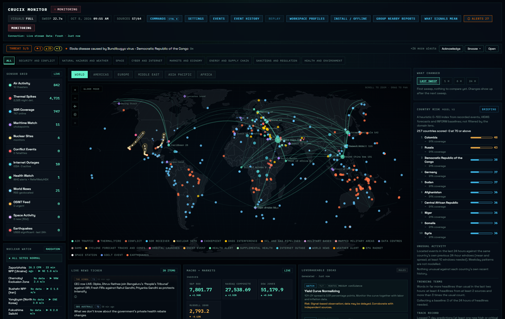
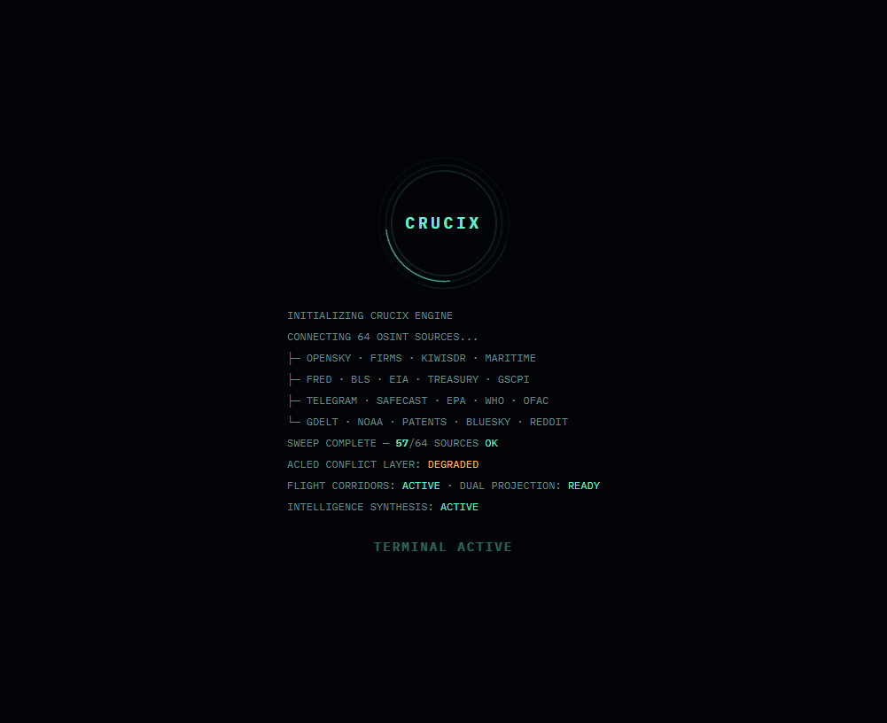
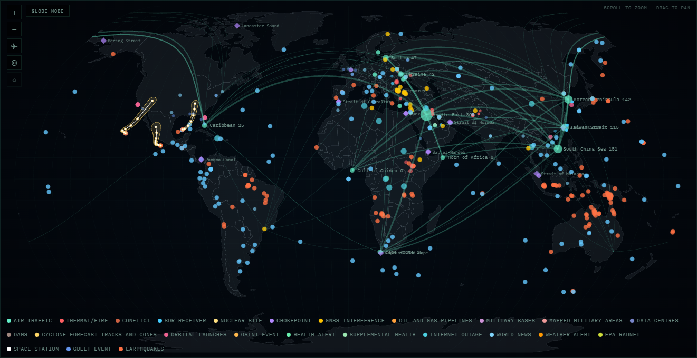
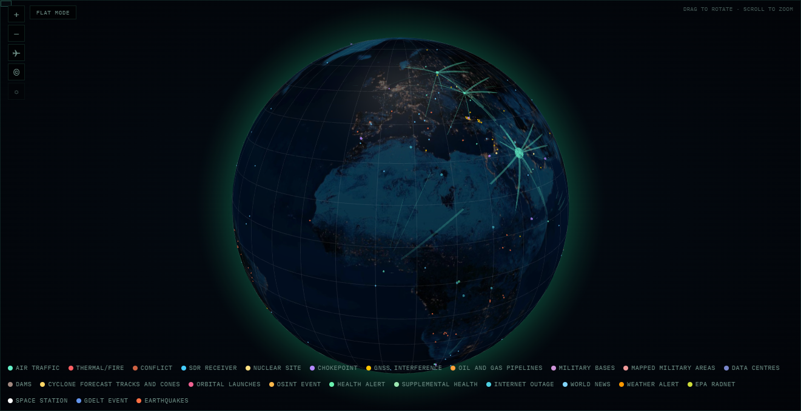

<div align="center">

# Crucix

**Your own intelligence terminal. 52 sources. One command. Local processing.**

[](#quick-start)
[](LICENSE)
[-orange)](#architecture)
[](#data-sources-52)
[](#docker)



<details>
<summary>More screenshots</summary>

| Boot Sequence | World Map |
|:---:|:---:|
|  |  |

| 3D Globe View |
|:---:|
|  |

</details>

</div>

> **Fork:** this repository is a fork of [calesthio/Crucix](https://github.com/calesthio/Crucix).
> This fork's releases, audit and installation instructions are below.
>
> **Showcase site:** an animated, bilingual (HU/EN) presentation of what Crucix does lives in [docs/site](docs/site/index.html) — open `docs/site/index.html` in a browser, no build step.

Crucix pulls satellite fire detection, flight tracking, radiation monitoring, satellite constellation tracking, economic indicators, live market prices, conflict data, sanctions lists, and social sentiment from 31 open-source intelligence feeds — in parallel, every 15 minutes — and renders everything on a single self-contained Jarvis-style dashboard.

Hook it up to an LLM and it becomes a **two-way intelligence assistant** — pushing multi-tier alerts to Telegram and Discord when something meaningful changes, responding to commands like `/brief` and `/sweep` from your phone, and generating actionable trade ideas grounded in real cross-domain data. Your own analyst that watches the world while you sleep.

The server and data run on your machine. External feeds need network access; browser map/font libraries are pinned local assets. Cloud AI and paid APIs are optional. The app has no built-in telemetry. Start with `node server.mjs`.

## Token / Asset Warning

> [!WARNING]
> **Crucix has not launched any official token, coin, NFT, airdrop, presale, or other blockchain-based asset.**
> Any token or digital asset using the Crucix name, logo, or branding is not affiliated with or endorsed by Crucix.
> Do not buy it, promote it, connect a wallet to claim it, sign transactions, or send funds based on third-party posts, DMs, or websites.

---

## Why This Exists

Most of the world's real-time intelligence — satellite imagery, radiation levels, conflict events, economic indicators, flight tracking, maritime activity — is publicly available. It's just scattered across dozens of government APIs, research institutions, and open data feeds that nobody has time to check individually.

Crucix brings it all into one place. Not behind a paywall, not locked in an enterprise platform, not requiring a security clearance. Just open data, aggregated and cross-correlated on your own machine, updated every 15 minutes.

It was built for anyone who wants to understand what's actually happening in the world right now — researchers, journalists, traders, OSINT analysts, or just curious people who believe access to information shouldn't depend on your budget.

---

## Quick Start

```bash
# 1. Clone the repo
git clone https://github.com/mp3pintyo/Crucix.git
cd Crucix

# 2. Install locked dependencies (Express plus optional Discord support)
npm ci

# 3. Copy env template and add your API keys (see below)
cp .env.example .env

# 4. Start the dashboard
npm run dev
```

> **If `npm run dev` fails silently** (exits with no output), run Node directly instead:
> ```bash
> node --trace-warnings server.mjs
> ```
> This bypasses npm's script runner, which can swallow errors on some systems (particularly PowerShell on Windows). You can also run `node diag.mjs` to diagnose the exact issue — it checks your Node version, tests each module import individually, and verifies port availability. See [Troubleshooting](#troubleshooting) for more.

The dashboard opens automatically at `http://localhost:3117` and immediately begins its first intelligence sweep. This initial sweep queries all 52 sources in parallel and typically takes 30–60 seconds — the dashboard will appear empty until the sweep completes and pushes the first data update. After that, it auto-refreshes every 15 minutes via SSE (Server-Sent Events). No manual page refresh needed.

**Requirements:** Node.js 22+ (uses native `fetch`, top-level `await`, ESM)

### Docker

```bash
git clone https://github.com/mp3pintyo/Crucix.git
cd Crucix
cp .env.example .env    # add your API keys
docker compose up -d
```

Dashboard at `http://localhost:3117`. Sweep data persists in `./runs/` via volume mount. Includes a health check endpoint.

### Access and privacy (v2.1)

The native server and Docker published port default to localhost. For LAN access, set `HOST=0.0.0.0` for native Node, or `BIND_ADDRESS=0.0.0.0` for Compose. Set both `AUTH_USER` and `AUTH_PASSWORD` to protect the dashboard, JSON APIs and event stream. A partial credential configuration fails at startup. Use an HTTPS reverse proxy when exposing password-protected access beyond the local machine; HTTP Basic authentication does not encrypt credentials. `/healthz` exposes only a minimal health status without authentication.

`PUBLIC_URL` controls dashboard links in bot messages. `NO_AUTO_OPEN=1` disables automatic browser launch. `PORT` accepts integers from 1 to 65535. The event stream has heartbeats and a configurable `MAX_SSE_CLIENTS` limit.

Public Telegram preview collection is disabled by default. Set `TELEGRAM_OSINT_ENABLED=true` to enable it. The OSINT source never reads private messages or control-bot updates; `TELEGRAM_BOT_TOKEN` is used only for alerts and commands. Discord commands are restricted to the configured channel and guild. Sweep/mute/unmute require Manage Server/Administrator permission or membership in `DISCORD_ALLOWED_USER_IDS`.

The container runs as UID 1000. On Linux, prepare the bind-mounted directory with `mkdir -p runs && sudo chown 1000:1000 runs` before starting Compose. Keep existing sweep files and adjust their ownership if necessary. The container checks `/healthz` using the configured port.

Run `npm run check` and `npm test` before submitting changes. See [the bilingual changelog](CHANGELOG.md) and [the audit plan](docs/audit/implementation-plan-2026-10-01.md).

### Data reliability and local models (v2.2)

The source registry now queries 31 adapters, including this fork's IODA and the keyless USGS significant-day earthquake feed. USGS coverage is significant earthquakes in the past day, not every earthquake above a magnitude threshold. Its tsunami flag does not establish that a warning was issued. Maritime chokepoints are reference locations; no live AIS connection is claimed by the briefing adapter.

`LLM_IDEAS_EVERY_N_SWEEPS=3` generates on the first sweep, then sweeps 3, 6, and so on. Intermediate sweeps reuse ideas with their original timestamp; the cache is per process. The default is 1. Delta alerts still evaluate every sweep, and failed model calls produce fresh rule-based ideas.

Failed, disabled and stale sources have separate states. OpenSky can reuse a successful observation for at most one hour, labelled with its original timestamp. Server sweeps atomically update `latest.json` and keep eight owned raw snapshots; existing user/CLI archives are preserved. News markers use stable inferred headline coordinates, and articles without a location stay in the ticker. GDELT timestamps retain provider time rather than sweep time. OFAC samples at most 64 KiB per export and marks partial/sample counts explicitly.

Ideas fall back to deterministic English/Hungarian rules when no model is enabled or its response fails validation. To use llama.cpp or LM Studio, set `LLM_PROVIDER=openai-compatible`, `LLM_BASE_URL=http://127.0.0.1:8080/v1`, and `LLM_MODEL` to the server's model name. The API key is optional; existing cloud providers and `OLLAMA_BASE_URL` keep their endpoints. In Docker, localhost refers to the container; use the host's reachable address, such as `http://host.docker.internal:8080/v1` on Docker Desktop.

`LLM_IDEAS_TIMEOUT_MS` and `LLM_ALERT_TIMEOUT_MS` accept 1000–360000 ms. Token ranges: `LLM_IDEAS_MAX_TOKENS` 128–16384; `LLM_ALERT_MAX_TOKENS` 128–4096. Defaults are 90000/30000 ms and 4096/800 tokens. Increase a local thinking model's budget explicitly when needed; `OLLAMA_REASONING_EFFORT` is optional and requires model support. The Codex subscription endpoint uses the timeout but does not support the same output-token cap in this adapter. Live provider/bot acceptance depends on your configured service; automated tests use mocked responses and local HTTP fixtures.

### Dashboard usability and audit (v2.3)

Settings share 13 logical layer switches between the flat map and globe, including earthquakes. Source health distinguishes failures, disabled collection and stale data; live connection status and snapshot age are separate. Ideas display rule/model origin and cached age. Missing first data has a waiting state; empty readings do not imply normal conditions.

The settings dialog supports keyboard focus, Escape and focus restoration. Panel order can be changed with Alt+Up/Down and panels can be assigned to a zone. Preferences survive reload when storage is available. Reduced-motion preferences disable automatic globe rotation. Desktop and 390px mobile checks cover layers, saved settings, malicious text, empty data, connection recovery and polling fallback.

Read the [full code audit and improvements](docs/audit/full-review-2026-10-01.md), the [individual assessment of all 104 upstream PRs and 50 issues](docs/audit/upstream-review-2026-10-01.md), and the [operations guide](docs/OPERATIONS.md) for source access, LAN/Docker, local models and troubleshooting. The [bilingual changelog](CHANGELOG.md) links each major release.

### Events, history and workspaces (v2.4–2.6)

Open **Events**, a news item or a supported map marker to inspect its original source, observed/published/collected times, location method, source status and related reports. Missing metadata stays unknown. Traceability checks describe available metadata; related articles and map groups do not establish independent confirmation.

**History** searches retained events by text, kind, source and UTC collection date, with pagination and a timeline. Export filtered results as JSON, CSV, printable HTML or STIX 2.1; use your browser's Print → Save as PDF for PDF. History retains at most 30 days, 10,000 records and 20 MiB in `runs/intelligence/history.json`. Exports cap at 2,000 records and flag truncation. The latest snapshot and new sweeps seed the journal; existing archives are preserved. History search/export requires the local server.

**Profiles** provides Research, Market and Infrastructure workspaces plus up to 12 named custom profiles containing panel layout, layers and region. Your previous configuration remains available as Custom. Blocked browser storage falls back to the current session.

Open `http://localhost:3117` once while the server runs. **PWA** settings and the browser install menu can install the dashboard where supported (Chrome/Edge on Windows); service workers require localhost or HTTPS. The static shell, maps, fonts and textures work after an offline reload. Saving the latest data is a separate **off-by-default** option in PWA settings. Saved data carries its collection time and an offline label; **Clear saved data** also disables further snapshot saving. New feeds, server history and exports still require the server/network. Updates wait for your explicit action. No native Windows wrapper is required.

See the [completed implementation register](docs/audit/intelligence-workspace-implementation.md) and [browser/test evidence](docs/audit/intelligence-workspace-verification.md).

### Record Inspector (v2.9)

The **Current public data** cards are summaries: state, provider time, record count, severity badges and the top three titles. **Open records** docks the Inspector on the right (a bottom sheet on phones): filter by severity, time window and text, sort, page through 25 records at a time and read each record's times, location, facts and original link; **Event details** opens the event dialog. Expand it into the full-screen record browser, whose **All sources** view covers every event (news, USGS, NOAA, WHO and more). Keys (while focus is inside the panel or the browser; **Open records** moves it there): `j`/`k` move, `Enter` details, `/` search, `e` expand, `Esc` close; the view is a shareable link such as `#src=GDACS&sev=high`. Severity is always a glyph plus a colour: ◆ critical, ▲ high, ● watch, ○ info, – unknown; provider words such as Red/Orange/Green are mapped onto these levels. CAP "Severe" is **high** (since v2.10; "Extreme" and "Red" stay critical).

### Alert engine (v2.10)

After every sweep the server evaluates alert rules. There are six kinds: **event** (a level range plus kinds, sources, plain-substring keywords and a radius), **threshold** (with an optional `clearValue` hysteresis), **change** (percent move between sweeps), **absence** (a source failing or stale), **convergence** (several kinds of event in one grid cell and time window) and **delta** (signals of the delta engine). Eight built-in rules (`events-critical`, `events-high`, `convergence-default`, `source-stale`, `vix-spike`, `hy-spread-wide`, `delta-critical`, `hungary-region`) are on from the start, and you can add up to 50 of your own. A hit must repeat for `forSweeps` consecutive sweeps before it opens an alert; an alert resolves after 2 sweeps without a hit, then the rule waits `cooldownMinutes`. An alert is **firing**, **acknowledged**, **snoozed** (15 minutes to 7 days) or **resolved**, and a more severe hit escalates it. The **first evaluation is a silent baseline**: alerts for events that already exist are marked "Initial baseline" and never notify or toast.

The dashboard shows an **alert strip** under the top bar (threat level 1–5 from firing alerts only, counts per level, the top alert with **Acknowledge**, **Snooze** and **Open**), a **bell** with the firing count (and an `(n)` prefix in the tab title for critical + high), a **tray** with the tabs Active, Handled, Resolved and Rules (grouped by rule, evidence links, **Acknowledge all**), **toasts** for new critical and high alerts, and a **rules editor** with a form per kind. A built-in rule is changed through an override that **Reset to default** removes. Alerts and rules live in `runs/alerts/` (`alerts.json`, `rules.json`, each with a `.bak` copy): at most 1000 alerts, resolved ones for 30 days. The threat level is the level of the most severe firing alert (info 2, watch 3, high 4, critical 5; none 1).

**Notifications.** Alerts always show in the dashboard. They are also sent when the rule's `notify` flag is on and the alert reaches `ALERT_NOTIFY_MIN_SEVERITY` (default `high`): to ntfy (`ALERT_NTFY_URL`) and a JSON webhook (`ALERT_WEBHOOK_URL`) when set, and to **Telegram and Discord only if you opt in** with `ALERT_NOTIFY_CHANNELS=telegram,discord` (default empty; existing installs must set it to get engine alerts there). The bots' `/mute` silences engine messages too; it does not affect ntfy or the webhook. Delta-derived alerts are not sent again to Telegram/Discord (the existing delta alerter does that; `delta-critical` has `notify` off). Per sweep at most `ALERT_MAX_NOTIFICATIONS_PER_SWEEP` messages go out individually (default 5), the rest as one "+N more alerts" summary; each alert notifies once per channel, again on escalation. `ALERT_QUIET_HOURS` lets only critical alerts through and reports the rest in one summary afterwards (held alerts are lost on a restart). Messages are plain text; failed sends are logged and not retried; channel URLs must be http(s) without credentials and are used as given (a trailing slash is removed, redirects count as failures). A rule you create or re-enable later notifies for everything it matches at once (events already in the baseline stay silent).

**Access, proxies and hosts.** The alert API sits behind your Basic auth. Changing requests (`POST`, `PUT`, `DELETE`) must send `Content-Type: application/json`, come from the page's own origin and stay under 8 KB. **Without `AUTH_USER`/`AUTH_PASSWORD`** they are accepted only through an IP address, `localhost`, the host of `ALERT_PUBLIC_URL` or a name in `ALERT_ALLOWED_HOSTS` (a guard against DNS rebinding), so an instance opened by a LAN host name needs one of those two variables (IP access works as before). Behind an HTTPS reverse proxy, preserve the `Host` header (nginx: `proxy_set_header Host $host;`) or set `ALERT_PUBLIC_URL`, whose origin is accepted. Without Basic auth the preserved host name must also be listed in `ALERT_ALLOWED_HOSTS` or be the host of `ALERT_PUBLIC_URL`, so setting `ALERT_PUBLIC_URL` is the simplest there. Known limits: no sound, a single operator, `source-stale` keeps showing a permanently failing source until you acknowledge it. Rule parameters and all limits are in the [release notes](docs/releases/v2.10.0.md); the Hungarian [operations guide](docs/OPERATIONS.md) covers day-to-day use.

### Ten new live sources (v2.11)

The **Current public data** panel grows from nine to 19 keyless sources: IMF PortWatch chokepoint transits, EMSC earthquakes, Copernicus EMS activations, aviation SIGMETs, adsb.lol military air activity, the OpenSanctions index, Federal Register OFAC/BIS documents, Hungarian power (Energy-Charts) and gas (ENTSOG) data and Manifold prediction markets. They are listed in the [Tier 7 table](#tier-7-current-public-data-19), feed the map layers and the alert engine (eleven new metrics) and are described, with their freshness rules, licences and limits, in the [release notes](docs/releases/v2.11.0.md). Known limits: PortWatch and adsb.lol see only ships with AIS and aircraft with ADS-B transponders on, three sources (IMF PortWatch, OpenSanctions, Manifold) are non-commercial by their terms, the live panel was tall with 19 cards (v2.12 groups them), and the PWA offline snapshot is refused above 5 MiB (about 1.8 MiB with every source's longest real row repeated up to its row cap).

### Two cyber feeds from the OSINT catalogue (v2.15)

The **Cyber and internet** lens gains two keyless sources found by analysing the [awesome-osint-arsenal](https://github.com/rawfilejson/awesome-osint-arsenal) catalogue: **ThreatFox** (abuse.ch, CC0: new indicators of compromise per malware family over 24 hours; single indicators are never listed) and **Have I Been Pwned** (CC BY 4.0: breaches added in the last 30 days, rated by size; sensitive, fabricated, spam-list and retired breaches are left out). Both are in the [Tier 7 table](#tier-7-current-public-data-19) below and described, with limits and the measurements behind the ratings, in the [release notes](docs/releases/v2.15.0.md). The Feodo Tracker was measured too and left out: it lists five servers, one online, last active in March 2026.

### Cyber incidents disclosed to the SEC (v2.17)

The **Cyber and internet** lens gains **SEC EDGAR 8-K Item 1.05**: US listed companies that told the SEC they suffered a material cybersecurity incident, with a link to the filing. The record inspector's "Look up elsewhere" block now also offers company registers (GLEIF, OpenCorporates) and the SEC filing list for a company name or CIK. The measurements, the choice of search phrases and why a GLEIF on-demand lookup was not built are in the [release notes](docs/releases/v2.17.0.md).

### Threat actor groups on the country sheet (v2.16)

The country sheet gains a **Threat actor groups** section from the keyless [MISP Galaxy](https://www.misp-galaxy.org/threat-actor/) catalogue (CC0): how many known adversary groups the MISP community attributes to the country, and the best-known twelve with their aliases. It is context only (no part of the risk score, no alert), always shown with the caveat that attribution is a suspicion, and described, with its limits, in the [release notes](docs/releases/v2.16.0.md).

### Dashboard structure (v2.12)

- **Domain lenses.** A bar under the alert strip offers **All** and eight domains (security and conflict, natural hazards and weather, space, cyber and internet, markets and economy, energy and supply chain, sanctions and regulation, health and environment) that together cover all 52 source adapters. A lens narrows the live panel, the source-health panel, the changes panel and its chip, the record browser's source list and the live record markers on both maps. News, OSINT and delta signals have no domain and only show under **All**; the older map layers keep their own switches. The choice is kept per browser (in memory only when storage is blocked).
- **Compact live panel.** The 19 cards sit in domain groups, collapsed to one line each (sources, records, worst severity, failing sources); a group that needs attention (a source not ok, or a high or critical record) opens by itself, and under a lens only that domain's group is shown, open. The failing-source chips of a collapsed group stay on one line (a long name is cut short with an ellipsis; its full text is in the tooltip and the button name, and "+N more" always shows). Collapsed, the panel measured 378 px (English) and 395 px (Hungarian and French) tall at 1280 px, the same with every source current, with one failing source per group and with every source failing (measured on the QA test fixture, not on a live sweep). The panel badge counts the cards shown: under a lens, that domain's current / shown cards. A focused group header or **Open records** button keeps the focus when the panel is redrawn.
- **Ctrl+K / Cmd+K command palette** (or the **Commands** button): actions (lenses, alerts, settings, signal guide, source-health matrix, record browser, replay, What changed, country risk briefing, Open country: <name>), one entry per source (it opens that source's records, or the matrix: it does not scroll to the source's row), and a live search of the record history from two characters (6 records, 200 ms after the last keystroke; a slower older answer never replaces a newer one). At most 12 results; ↑/↓, Home/End, Enter, Esc. It does not take the inspector's keys and does nothing while another dialog is open.
- **Source-health matrix** (the **Matrix** button of the Source health panel, or the palette): every source × the last archived sweeps (48 by default, up to the retention), grouped by domain. Each cell is a glyph and a word (✓ OK, ◔ Stale, ✕ Error, – Disabled, · No data), the last column the newest run time; arrow keys move between cells (a screen reader hears each one as source, sweep time and state, e.g. "GDELT, Oct 3 09:00, OK") and a cell opens that sweep in the replay.
- **What changed.** A right-rail panel and a `Δ N` header chip: new records (most severe first), source state changes and delta signals since the previous sweep, with per-domain counts and the windows Last sweep / 1 h / 6 h / 24 h (a merged window's totals are upper bounds, shown as "up to"). Each list shows three rows until **Show all**. The chip always counts the last sweep, under the active lens.
- **Sweep replay** (the **Replay** button, a matrix cell or the palette): step through archived sweeps with the slider, ◀ / ▶ or the arrow keys. The dashboard redraws the chosen sweep with its clock frozen at the sweep's time, under a REPLAY bar with **Back to live**. Live updates are kept aside (the bar counts them) and applied when you go back; nothing is written to the offline cache. Alerts stay live; event history, export and alert evidence links are off during a replay. The button stays disabled, with the reason, until two sweeps are archived.

The server stores every sweep in `RUNS_DIR/sweeps` (`SWEEP_ARCHIVE_COUNT`, `SWEEP_ARCHIVE_MAX_MB`; a measured real sweep with all 19 live sources current was 757,482 bytes of JSON and 110,404 bytes gzipped, so the default 96 sweeps take about 11 MB) and serves it through four read-only routes (see [API Endpoints](#api-endpoints)). Replay steps over stored sweeps, not continuous time, and only sweeps archived by 2.12.0 or later exist. Storage, retention and the known limits are in the Hungarian [operations guide](docs/OPERATIONS.md#söprés-archívum-és-változások). The measured numbers, the route contracts and the full list of known limits are in the [release notes](docs/releases/v2.12.0.md).

### Country risk and cited briefings (v2.13, server side)

- **Country risk 0–100.** After the events of each sweep the server links every event to at most three countries (trusted coordinates or a structured place name count as *located*; news and keyword-placed records only by a country named in their title or summary, as *mentioned*) and scores each country from six components: located events of the last 24 hours, persistence over 7 days, diversity of high-level event kinds, news attention (after 7 days of data), the [VIEWS](#tier-8-country-risk-inputs-2) conflict forecast for the current month and the INFORM baseline. A missing component is left out and the rest renormalised; `coverage` says how much of the model was available. It is a **heuristic index, not a probability** and not an official rating. Three or more physical event kinds at high or above in 24 hours mark a country as *convergent*.
- **Logged predictions.** Once a day per active country the server logs "will a new located high-level physical event happen in the next 7 days?" and scores it from its own stored data after 7 days (Brier score, skill against the base rate, reliability bins). Until 30 predictions are resolved it says "not enough data yet".
- **Cited briefings.** `POST /api/briefing` writes a global or per-country briefing of at most 8 bullets. With an LLM configured the model sees numbered rows, treated as untrusted observations, and must cite row numbers; the server drops invalid numbers and uncited bullets, strips markup and cuts each bullet to 400 characters. Without an LLM, or when it fails, a rule-based briefing in `CRUCIX_LANG` comes back in the same shape, every bullet citing a real record. At most 2 model calls run at once: a further request gets the rule-based briefing with `busy: true` (not cached), and the prompt holds at most 24,000 characters, so only the rows it shows can be cited.
- **Alerts.** Two new metrics, `risk_max_score` and `risk_countries_high` (countries scored 70 or more), work with the threshold and change rules; they are empty while no risk summary exists.

The step runs before the alert step and the archive, never stops a sweep (`/api/health` reports `riskStatus`), and adds about 2 KB (`risk`) to each snapshot. Data lives in `RUNS_DIR/intelligence/countries.json` and `predictions.json` (`RISK_RETENTION_DAYS`, default 35); `RISK_ENABLED=false` turns all of it off. Files, measured sizes and the route contracts are in the Hungarian [operations guide](docs/OPERATIONS.md#országkockázat-előrejelzések-és-hivatkozott-összefoglaló-213). The score model and its honest limits, the measured numbers, the verbatim licence wording of the two new sources and why ACLED CAST was not used are in the [release notes](docs/releases/v2.13.0.md).

### Country risk views (v2.13, dashboard)

- **Country risk panel** (right rail, under What changed; a saved layout that never had it gets it there): the top 10 countries of the last sweep with a score bar and number, the 24-hour change as a glyph and a number (▲ +N, ▼ -N; `–` "no history yet" until there is a day of data, never 0), the coverage (the share of the model weight that had data) and a ◆ convergence mark with the event kinds in its tooltip. A **Track record** section shows the resolved prediction count, Brier score and skill, or "not enough resolved predictions yet (n=…)" below 30. The panel is not filtered by the domain lens: a country has no domain. It measured 628–665 px tall at 1280 px and 696–712 px at 390 px (English, Hungarian, French) on the QA fixture's 10 rows.
- **Country sheet** (a panel row, a click on a country of the flat map, or **Open country: <name>** in Ctrl+K): the score with every component, its weight and whether it had data, a sparkline with a text alternative, the VIEWS forecast months (run id, attribution, licence), the INFORM baseline (release, attribution), convergence, the 20 most recent linked records (each opens in the record inspector) and the linked countries (each opens its own sheet).
- **Briefing** (the panel's **Briefing** button, the sheet's **Briefing for this country**, or **Country risk briefing** in Ctrl+K): pick Global or one of the top countries and **Generate**. Each statement carries citation chips `[n]` that open the cited record; the answer is labelled **AI-generated from the cited records** or **Rule-based summary**, and citations are checked against real records (a statement without a valid one is dropped).
- **Replay and offline limits.** During a sweep replay the panel shows the replayed sweep's own ranking, but the country sheet and the briefing read the live store, so they are off and say why (rows and the Briefing button are disabled, a map click shows only the reason, the palette leaves them out). On file pages and in the offline shell there is no country sheet or briefing, and the same holds without a risk summary (`RISK_ENABLED=false`, or a replayed sweep archived before 2.13): the panel says "Country risk is not available.", the palette leaves the country items out and a map click does nothing.

---

## What You Get

### Live Dashboard
A self-contained Jarvis-style HUD with:
- **3D WebGL globe** (Globe.gl) with atmosphere glow, star field, and smooth rotation — plus a classic flat map toggle
- **Shared layer controls** across both views: fire, air, radiation, maritime references, SDR, OSINT, health, inferred news, conflict, internet outages, weather, earthquakes and estimated satellite positions
- **Animated 3D flight corridor arcs** between air traffic hotspots and global hubs
- **Region filters** (World, Americas, Europe, Middle East, Asia Pacific, Africa) — rotates the globe or zooms the flat map
- **Live market data** — indexes, crypto, energy, commodities via Yahoo Finance (no API key needed)
- **Risk gauges** — VIX, high-yield spread, supply chain pressure index
- **OSINT feed** — English-language posts from 17 Telegram intelligence channels (expandable)
- **News ticker** — merged RSS + GDELT headlines + Telegram posts, auto-scrolling
- **Sweep delta** — live panel showing what changed since last sweep (new signals, escalations, de-escalations with severity)
- **Cross-source signals** — correlated intelligence across satellite, economic, conflict, and social domains
- **Nuclear watch** — recent (72 h) radiation readings from Safecast, shown with their age, plus EPA RadNet when reachable
- **Space watch** — CelesTrak satellite tracking: recent launches, ISS, military constellations, Starlink/OneWeb counts
- **Leverageable ideas** — AI-generated trade ideas (with LLM) or signal-correlated ideas (without)

### Performance Modes
The `VISUALS FULL` / `VISUALS LITE` button in the top bar only changes rendering behavior - it does **not** remove data sources or reduce sweep coverage.

When you switch to **VISUALS LITE**, the dashboard:
- Disables decorative background effects such as the radial/grid overlays and scanlines
- Removes expensive blur/backdrop-filter effects on panels and overlays
- Stops non-essential animations like the logo ring blink, conflict rings, and corridor flow effects
- Disables globe auto-rotation and turns off animated flight-arc dashes
- Converts the horizontal news ticker and OSINT stream into static, scrollable lists instead of continuously animated marquees

Mobile-specific behavior:
- On mobile, `VISUALS LITE` also forces the dashboard into **flat map mode** if you are currently on the globe
- Future mobile loads will continue to start flat while low-perf mode is enabled

The preference is saved in browser local storage, so the UI will remember your last setting.

### Auto-Refresh
The server runs a sweep cycle every 15 minutes (configurable). Each cycle:
1. Queries all 52 sources in parallel (~30s)
2. Synthesizes raw data into dashboard format
3. Computes delta from previous run (what changed, escalated, de-escalated) — visible in the **Sweep Delta** panel on the dashboard
4. Generates LLM trade ideas (if configured)
5. Evaluates breaking news alerts — multi-tier (FLASH / PRIORITY / ROUTINE) with semantic dedup. Sends to Telegram and/or Discord if configured. Works with LLM evaluation or falls back to rule-based alerting when LLM is unavailable.
6. Evaluates the [alert engine](#alert-engine-v210) rules: alerts for the dashboard and, if configured, ntfy/webhook (Telegram/Discord by opt-in)
7. Pushes update to all connected browsers via SSE

### Telegram Bot (Two-Way)
Crucix doubles as an interactive Telegram bot. Beyond sending alerts, it responds to commands directly from your chat:

| Command | What It Does |
|---------|-------------|
| `/status` | System health, last sweep time, source status, LLM status |
| `/sweep` | Trigger a manual sweep cycle |
| `/brief` | Compact text summary of the latest intelligence (direction, key metrics, top OSINT) |
| `/portfolio` | Portfolio status (if Alpaca connected) |
| `/alerts` | Recent alert history with tiers |
| `/mute` / `/mute 2h` | Silence alerts for 1h (or custom duration) |
| `/unmute` | Resume alerts |
| `/help` | Show all available commands |

This requires `TELEGRAM_BOT_TOKEN` and `TELEGRAM_CHAT_ID` in `.env`. The bot polls for messages every 5 seconds (configurable via `TELEGRAM_POLL_INTERVAL`).

### Discord Bot (Two-Way)

Crucix also supports Discord as a full-featured bot with slash commands and rich embed alerts. It mirrors the Telegram bot's capabilities with Discord-native formatting.

| Command | What It Does |
|---------|-------------|
| `/status` | System health, last sweep time, source status, LLM status |
| `/sweep` | Trigger a manual sweep cycle |
| `/brief` | Compact text summary of the latest intelligence |
| `/portfolio` | Portfolio status (if Alpaca connected) |

Alerts are delivered as rich embeds with color-coded sidebars: red for FLASH, yellow for PRIORITY, blue for ROUTINE. Each embed includes signal details, confidence scores, and cross-domain correlations.

**Setup requires:** `DISCORD_BOT_TOKEN`, `DISCORD_CHANNEL_ID`, and optionally `DISCORD_GUILD_ID` for instant slash command registration. See [API Keys Setup](#api-keys-setup) for details.

**Webhook fallback:** If you don't want to run a full bot, set `DISCORD_WEBHOOK_URL` instead. This enables one-way alerts (no slash commands) with zero dependencies — no `discord.js` needed.

**Optional dependency:** The full bot requires `discord.js`. Install it with `npm install discord.js`. If it's not installed, Crucix automatically falls back to webhook-only mode.

### Optional LLM Layer
Connect any of 10 LLM providers for enhanced analysis:
- **AI trade ideas** — quantitative analyst producing 5-8 actionable ideas citing specific data
- **Smarter alert evaluation** — LLM classifies signals into FLASH/PRIORITY/ROUTINE tiers with cross-domain correlation and confidence scoring
- Providers: Anthropic Claude, OpenAI, Google Gemini, OpenRouter (Unified API), OpenAI Codex (ChatGPT subscription), MiniMax, Mistral, Grok, Ollama, and OpenAI-compatible servers
- Graceful fallback — when LLM is unavailable, a rule-based engine takes over alert evaluation. LLM failures never crash the sweep cycle.

---

## API Keys Setup

Copy `.env.example` to `.env` at the project root:

```bash
cp .env.example .env
```

### Required for Best Results (all free)

| Key | Source | How to Get |
|-----|--------|------------|
| `FRED_API_KEY` | Federal Reserve Economic Data | [fred.stlouisfed.org](https://fred.stlouisfed.org/docs/api/api_key.html) — instant, free |
| `FIRMS_MAP_KEY` | NASA FIRMS (satellite fire data) | [firms.modaps.eosdis.nasa.gov](https://firms.modaps.eosdis.nasa.gov/api/area/) — instant, free |
| `EIA_API_KEY` | US Energy Information Administration | [api.eia.gov](https://www.eia.gov/opendata/register.php) — instant, free |

These three unlock the most valuable economic and satellite data. Each takes about 60 seconds to register.

### Optional (enable additional sources)

| Key | Source | How to Get |
|-----|--------|------------|
| `ACLED_EMAIL` + `ACLED_PASSWORD` | Armed conflict event data | [acleddata.com/register](https://acleddata.com/register/) — free, OAuth2 |
| `AISSTREAM_API_KEY` | Maritime AIS vessel tracking | [aisstream.io](https://aisstream.io/) — free |
| `ADSB_API_KEY` | Unfiltered flight tracking | [RapidAPI](https://rapidapi.com/adsbexchange/api/adsbexchange-com1) — ~$10/mo |

### LLM Provider (optional, for AI-enhanced ideas)

Set `LLM_PROVIDER` to one of: `anthropic`, `openai`, `gemini`, `codex`, `openrouter`, `minimax`, `mistral`, `grok`, `ollama`, `openai-compatible`

| Provider | Key Required | Default Model |
|----------|-------------|---------------|
| `anthropic` | `LLM_API_KEY` | claude-sonnet-4-6 |
| `openai` | `LLM_API_KEY` | gpt-5.4 |
| `gemini` | `LLM_API_KEY` | gemini-3.1-pro |
| `openrouter` | `LLM_API_KEY` | openrouter/auto |
| `codex` | None (uses `~/.codex/auth.json`) | first listed model of your account (gpt-6.1-sol) |
| `minimax` | `LLM_API_KEY` | MiniMax-M2.5 |
| `mistral` | `LLM_API_KEY` | mistral-large-latest |
| `grok` | `LLM_API_KEY` | grok-4-latest |
| `ollama` | None | llama3.1:8b |
| `openai-compatible` | Optional | local-model (override for your server) |

For Codex, run `npx @openai/codex login` to authenticate via your ChatGPT subscription.

### Telegram Bot + Alerts (optional)

| Key | How to Get |
|-----|------------|
| `TELEGRAM_BOT_TOKEN` | Create via [@BotFather](https://t.me/BotFather) on Telegram |
| `TELEGRAM_CHAT_ID` | Get via [@userinfobot](https://t.me/userinfobot) |
| `TELEGRAM_CHANNELS` | *(Optional)* Comma-separated extra channel IDs to monitor beyond the 17 built-in channels |
| `TELEGRAM_POLL_INTERVAL` | *(Optional)* Bot command polling interval in ms (default: 5000) |

### Discord Bot + Alerts (optional)

| Key | How to Get |
|-----|------------|
| `DISCORD_BOT_TOKEN` | Create at [Discord Developer Portal](https://discord.com/developers/applications) → Bot → Token |
| `DISCORD_CHANNEL_ID` | Right-click channel in Discord (Developer Mode on) → Copy Channel ID |
| `DISCORD_GUILD_ID` | *(Optional)* Right-click server → Copy Server ID. Enables instant slash command registration (otherwise takes up to 1 hour for global commands) |
| `DISCORD_WEBHOOK_URL` | *(Optional)* Channel Settings → Integrations → Webhooks → New Webhook → Copy URL. Use this for alert-only mode without a bot |

**Discord bot setup:**
1. Go to [Discord Developer Portal](https://discord.com/developers/applications) and create a new application
2. Go to **Bot** → click **Reset Token** → copy the token to `DISCORD_BOT_TOKEN`
3. Under **Privileged Gateway Intents**, enable **Message Content Intent**
4. Go to **OAuth2** → **URL Generator** → select `bot` + `applications.commands` scopes → select `Send Messages` + `Embed Links` permissions
5. Copy the generated URL and open it in your browser to invite the bot to your server
6. Install the dependency: `npm install discord.js`

Alerts work with or without an LLM on both Telegram and Discord. With an LLM configured, signal evaluation is richer and more context-aware. Without one, a deterministic rule engine evaluates signals based on severity, cross-domain correlation, and signal counts. Messages of the v2.10 [alert engine](#alert-engine-v210) reach Telegram and Discord only when `ALERT_NOTIFY_CHANNELS` lists them.

### Without Any Keys

Crucix still works with zero API keys. 18+ sources require no authentication at all. Sources that need keys return structured errors and the rest of the sweep continues normally.

---

## Architecture

```
crucix/
├── server.mjs                 # Express dev server (SSE, auto-refresh, LLM, bot commands)
├── crucix.config.mjs          # Configuration with env var overrides + delta thresholds
├── diag.mjs                   # Diagnostic script — run if server fails to start
├── .env.example               # All documented env vars
├── package.json               # Runtime: express | Optional: discord.js
├── docs/                      # Screenshots for README
│
├── apis/
│   ├── briefing.mjs           # Master orchestrator — runs all 52 sources in parallel
│   ├── save-briefing.mjs      # CLI: save timestamped + latest.json
│   ├── BRIEFING_PROMPT.md     # Intelligence synthesis protocol
│   ├── BRIEFING_TEMPLATE.md   # Briefing output structure
│   ├── utils/
│   │   ├── fetch.mjs          # safeFetch() — timeout, retries, abort, auto-JSON
│   │   └── env.mjs            # .env loader (no dotenv dependency)
│   └── sources/               # 52 registered source adapters
│       ├── gdelt.mjs          # Each exports briefing() → structured data
│       ├── fred.mjs           # Can run standalone: node apis/sources/fred.mjs
│       ├── space.mjs          # CelesTrak satellite tracking
│       ├── yfinance.mjs       # Yahoo Finance — free live market data
│       └── ...                # Other registered sources and supporting modules
│
├── dashboard/
│   ├── inject.mjs             # Data synthesis + standalone HTML injection
│   └── public/
│       └── jarvis.html        # Self-contained Jarvis HUD
│
├── lib/
│   ├── llm/                   # LLM abstraction (10 providers, raw fetch, no SDKs)
│   │   ├── provider.mjs       # Base class
│   │   ├── anthropic.mjs      # Claude
│   │   ├── openai.mjs         # GPT
│   │   ├── gemini.mjs         # Gemini
│   │   ├── grok.mjs           # Grok
│   │   ├── openrouter.mjs     # OpenRouter (Unified API)
│   │   ├── codex.mjs          # Codex (ChatGPT subscription)
│   │   ├── minimax.mjs        # MiniMax (M2.5, 204K context)
│   │   ├── mistral.mjs        # Mistral AI
│   │   ├── ollama.mjs         # Local Ollama
│   │   ├── openai-compatible.mjs # Local/custom compatible endpoints
│   │   ├── ideas.mjs          # Normalized ideas with rules fallback
│   │   └── index.mjs          # Factory: createLLMProvider()
│   ├── delta/                 # Change tracking between sweeps
│   │   ├── engine.mjs         # Delta computation — semantic dedup, configurable thresholds, severity scoring
│   │   ├── memory.mjs         # Hot memory (3 runs, atomic writes) + cold storage (daily archives)
│   │   └── index.mjs          # Re-exports
│   └── alerts/
│       ├── telegram.mjs       # Multi-tier alerts (FLASH/PRIORITY/ROUTINE) + two-way bot commands
│       └── discord.mjs        # Discord bot (slash commands, rich embeds) + webhook fallback
│
└── runs/                      # Runtime data (gitignored)
    ├── latest.json            # Most recent sweep output
    └── memory/                # Delta memory (hot.json + cold/YYYY-MM-DD.json)
```

### Design Principles
- **Pure ESM** — every file is `.mjs` with explicit imports
- **Minimal dependencies** — Express is the only runtime dependency. `discord.js` is optional (for Discord bot). LLM providers use raw `fetch()`, no SDKs.
- **Parallel execution** — `Promise.allSettled()` fires all 52 sources simultaneously
- **Graceful degradation** — missing keys are disabled, upstream errors are visible, and model failures use rules. Other sources continue.
- **Each source is standalone** — run `node apis/sources/gdelt.mjs` to test any source independently
- **Self-contained dashboard** — the HTML file works with or without the server

---

## Data Sources (52)

### Tier 1: Core OSINT & Geopolitical (11)

| Source | What It Tracks | Auth |
|--------|---------------|------|
| **GDELT** | Conflict, economy, health and crisis stories from the 15-minute GKG news feed (100+ languages), ranked by theme focus (distinct themes count more than one repeated theme), with city-level map points | None |
| **OpenSky** | ADS-B observations across 10 hotspots; fallback expires after one hour | None |
| **NASA FIRMS** | Satellite fire/thermal anomaly detection (3hr latency) | Free key |
| **Maritime** | Reference chokepoints; the briefing adapter does not connect to live AIS | None for reference data |
| **Safecast** | Citizen-science radiation readings near 6 nuclear sites; two sites are refreshed per sweep and the rest come from a cache of at most 3 hours with its age shown | None |
| **ACLED** | Armed conflict events: battles, explosions, protests | Free (OAuth2) |
| **ReliefWeb** | UN humanitarian crisis tracking | None |
| **WHO** | Disease outbreaks and health emergencies | None |
| **OFAC** | US Treasury sanctions (SDN list) | None |
| **OpenSanctions** | Aggregated global sanctions (30+ sources) | Partial |
| **ADS-B Exchange** | Unfiltered flight tracking including military | Paid |

### Tier 2: Economic & Financial (7)

| Source | What It Tracks | Auth |
|--------|---------------|------|
| **FRED** | 22 key indicators: yield curve, CPI, VIX, fed funds, M2 | Free key |
| **US Treasury** | National debt, yields, fiscal data | None |
| **BLS** | CPI, unemployment, nonfarm payrolls, PPI | None |
| **EIA** | WTI/Brent crude, natural gas, inventories | Free key |
| **GSCPI** | NY Fed Global Supply Chain Pressure Index | None |
| **USAspending** | Federal spending and defense contracts | None |
| **UN Comtrade** | Strategic commodity trade flows between major powers | None |

### Tier 3: Weather, Environment, Tech, Social, SIGINT (8)

| Source | What It Tracks | Auth |
|--------|---------------|------|
| **NOAA/NWS** | Active US weather alerts | None |
| **EPA RadNet** | US government radiation monitoring | None |
| **USPTO Patents** | Patent filings in 7 strategic tech areas | None |
| **Bluesky** | Social sentiment on geopolitical/market topics | None |
| **Reddit** | Social sentiment from key subreddits | OAuth |
| **Telegram** | Public channel previews, opt-in; never private bot updates | Explicit opt-in |
| **KiwiSDR** | Global HF radio receiver network (~600 receivers) | None |
| **USGS** | Significant earthquakes in the past day | None |

### Tier 4: Space & Satellites (1)

| Source | What It Tracks | Auth |
|--------|---------------|------|
| **CelesTrak** | Satellite launches, ISS tracking, military constellations, Starlink/OneWeb counts | None |

### Tier 5: Live Market Data (1)

| Source | What It Tracks | Auth |
|--------|---------------|------|
| **Yahoo Finance** | Real-time prices: SPY, QQQ, BTC, Gold, WTI, VIX + 9 more | None |

### Tier 6: Cyber & Infrastructure (3)

| Source | What It Tracks | Auth |
|--------|---------------|------|
| **CISA KEV** | Known exploited vulnerability catalog | None |
| **Cloudflare Radar** | Internet outages and traffic anomalies | API token |
| **IODA** | Internet connectivity anomaly signals | None |

---

### Tier 7: Current public data (19)

All 19 feeds are free and require no API key. The **Current public data** panel shows provider time, status, attribution and a summary of the current records, which open in the [Record Inspector](#record-inspector-v29). Records have original links and enter event details, searchable history and exports. Located records are map markers in the layer of their kind (earthquakes, maritime, air, natural events, weather) and colour; a quake that USGS and EMSC both report (within 60 s and 100 km) is drawn once, as the USGS marker, while both events stay in the lists. Provider dates are checked again on snapshot reads and in the browser, including offline PWA restores; expired values are hidden.

| Source | Data / default watched scope | Freshness ceiling |
| --- | --- | --- |
| Meteoalarm Atom | Active warnings: Hungary, Austria, Germany | Feed 3h; issued warning 48h and not expired |
| GDACS | Current disaster updates worldwide; future onsets excluded | Feed 6h; event update 72h |
| NOAA SWPC | Current R/S/G scales; zero means no active alert | 1h |
| ECB | Daily EUR/HUF, USD, GBP, CHF reference rates | 5 days for weekends/holidays; date precision |
| NASA EONET | Open natural events, latest Point geometry worldwide | 72h |
| RIPEstat | AS5483 routing visibility; 00/08/16 UTC snapshots | 8h |
| FIRST EPSS | Daily estimates for 20 CVEs first scored in the last 7 days | 48h; predictions, not confirmed exploitation |
| MET Norway | Budapest model forecast, separate target/validity times | Model 8h; target within 1h of now and valid interval |
| OONI | Five recent public HU web-connectivity measurements | 24h; samples, not country-wide conclusions |

Added in v2.11 (ten more keyless feeds; every request is bounded to 10 s and 2 MiB, 3 MiB for the OpenSanctions index):

| Source | Data / default watched scope | Endpoint | Auth | Freshness ceiling | Licence |
| --- | --- | --- | --- | --- | --- |
| IMF PortWatch | AIS-visible daily ship transits at 8 chokepoints (latest published day, 2–9 days behind), rated on the 7-day mean against the previous 28-day median (only from 10 transits a day) | `services9.arcgis.com/…/Daily_Chokepoints_Data` (ArcGIS) | None | Feed and day 10 days; 6h cache | IMF terms: personal, non-commercial use |
| EMSC | M4.5+ earthquakes of the last 24 h, largest first, up to 100 | `seismicportal.eu/fdsnws/event/1/query` | None | Feed 12h; quake 26h | CC BY 4.0 |
| Copernicus EMS | Rapid-mapping activations (no severity is published: moderate) | `mapping.emergency.copernicus.eu/backend/dashboard-api/public-activations-info/` | None | Feed 45 days; activation 30 days; 1h cache | Free, full and open (Regulation (EU) 2021/696) |
| Aviation SIGMET | International SIGMETs worldwide (volcanic ash, tropical cyclone, severe turbulence and icing, thunderstorms) that have started and not expired | `aviationweather.gov/api/data/isigmet` | None | Feed 3h; SIGMET 24h and valid-until | Public domain (NWS) |
| ADSB-Military (adsb.lol) | Military aircraft per watched theater (an aggregate at the box centre, not positions) and 7700/7600/7500 emergency squawks | `api.adsb.lol/v2/mil`, `/v2/sqk/<code>` | None | 25 min | ODbL 1.0 |
| OpenSanctions index | Last change and entry count of six sanctions lists (OFAC SDN, EU FSF, UN SC, UK FCDO, BIS Denied, US CSL) | `data.opensanctions.org/datasets/latest/index.json` | None | Index 48h; list change 14 days; 1h cache | CC BY-NC 4.0 |
| Federal Register | Newest OFAC and BIS documents | `federalregister.gov/api/v1/documents.json` | None | 14 days; 1h cache | Public domain |
| Energy-Charts HU | Hungarian day-ahead power price, Continental Europe grid frequency, Hungarian renewable share of generation | `api.energy-charts.info` (`/price`, `/frequency`, `/public_power`) | None | 6h; 2 min cache | CC BY 4.0 (price: Bundesnetzagentur \| SMARD.de) |
| ENTSOG HU | Physical gas flow at the 7 Hungarian cross-border points, latest completed gas day | `transparency.entsog.eu/api/v1/operationaldata` | None | 72h; 1 request an hour while it answers (a failure is retried at the next sweep) | ENTSOG Transparency Platform terms (re-use with citation) |
| Prediction markets (Manifold) | Play-money markets whose question matches the watched words, most traded first, up to 20 | `api.manifold.markets/v0/search-markets` | None | Last bet 12h, market not closed; 30 min cache | Manifold terms: personal, non-commercial use |
| ThreatFox (abuse.ch) | New indicators of compromise of the last 24 h per malware family, top 10; moderate from 100 | `threatfox.abuse.ch/export/json/recent/` | None | Feed 6h; row 24h; 10 min cache | CC0 |
| Have I Been Pwned | Breaches added in the last 30 days (not sensitive, fabricated, spam or retired); moderate from 1 million accounts, high from 10 million | `haveibeenpwned.com/api/v3/breaches` | None | Feed 14 days; row 30 days; 1h cache | CC BY 4.0 |
| SEC EDGAR 8-K Item 1.05 | Form 8-K filings of the last 90 days that report a material cybersecurity incident (company, form, filing day, link; every row high) | `efts.sec.gov/LATEST/search-index` (two phrases, spaced a second apart) | None (optional `SEC_USER_AGENT`) | Feed 90 days; row 90 days; 1h cache | Public domain |

Alert rules can watch the new metrics `<chokepoint>_transits` (PortWatch 7-day mean, transits a day; `hormuz_transits`, `suez_transits` and the other six default chokepoints), `hu_power_price` (EUR/MWh), `grid_frequency_hz` and `mil_aircraft_total` (military aircraft worldwide, airborne, position within 2 minutes); a metric is empty while its source is stale or failing. The HU day-ahead price runs high (median about 194 EUR/MWh over 2026-09-19..10-02; price rows are rated only from 300 and 400 EUR/MWh), so give a `hu_power_price` threshold rule its own level.

Edit the small `publicSources` watchlists in `crucix.config.mjs` for Meteoalarm countries, RIPE ASNs, MET location labels/coordinates, OONI countries, PortWatch chokepoints (`portwatchChokepoints`), ADS-B theater boxes (`adsbTheaters`) and prediction-market words (`marketQueries`). Each adapter validates and limits its inputs. MET identifies Crucix with a project/contact User-Agent; public requests and memory caches are bounded. Empty current feeds remain distinct from failed or undated feeds. World Bank annual indicators are deliberately excluded because this installation requires current data.

Full endpoint, freshness and validation evidence: [source assessment](docs/audit/fresh-data-implementation-2026-10-01.md).

### Tier 8: Country risk inputs (2)

Both are free and key-less, every request is bounded to 10 s and 2 MiB, and the country-risk model reads them (a missing source only lowers the coverage of a score). They are plain sources: a source-health row, no live-data card, listed under the security and conflict lens.

| Source | What it tracks | Endpoint | Cache | Attribution and licence |
| --- | --- | --- | --- | --- |
| VIEWS-Forecast | Predicted probability of at least 25 battle-related deaths in state-based armed conflict, and predicted fatalities, per country for the three months after the newest run's data month; a forecast, not observed events | `api.viewsforecasting.org` (run list, then `/<run>/cm/sb`) | Run list 24 h; data per run id; last good payload 45 days, shown as stale | "VIEWS (Uppsala University and PRIO)" and the run id; the provider states no data licence (its code repositories are CC BY-NC) |
| INFORM-Risk | INFORM Risk Index, 0-10 per country (higher is worse), newest published release; a yearly baseline | `drmkc.jrc.ec.europa.eu/inform-index/API/InformAPI` (release list, then scores) | Release list 24 h; scores 7 days; last good result 45 days, shown as stale | "INFORM Risk Index, European Commission Joint Research Centre (DRMKC) / INFORM partnership, <release>"; the provider says only "INFORM is open-source" |

## npm Scripts

| Script | Command | Description |
|--------|---------|-------------|
| `npm run dev` | `node --trace-warnings server.mjs` | Start dashboard with auto-refresh |
| `npm run sweep` | `node apis/briefing.mjs` | Run a single sweep, output JSON to stdout |
| `npm run inject` | `node dashboard/inject.mjs` | Inject latest data into static HTML |
| `npm run brief:save` | `node apis/save-briefing.mjs` | Run sweep + save timestamped JSON |
| `npm run diag` | `node diag.mjs` | Run diagnostics (Node version, imports, port check) |
| `npm test` | `node --test test/*.test.mjs` | Local regressions using mocks/fixtures |
| `npm run check` | `node scripts/check.mjs` | JavaScript syntax and locale checks |

---

## Configuration

All settings are in `.env` with sensible defaults:

| Variable | Default | Description |
|----------|---------|-------------|
| `PORT` | `3117` | Dashboard server port |
| `REFRESH_INTERVAL_MINUTES` | `15` | Auto-refresh interval |
| `LLM_PROVIDER` | disabled | `anthropic`, `openai`, `gemini`, `codex`, `openrouter`, `minimax`, `mistral`, `ollama`, `grok`, `openai-compatible` |
| `LLM_API_KEY` | — | API key (not needed for codex/local Ollama; optional for a local compatible server) |
| `LLM_MODEL` | per-provider default | Override model selection |
| `TELEGRAM_BOT_TOKEN` | disabled | For Telegram alerts + bot commands |
| `TELEGRAM_CHAT_ID` | — | Your Telegram chat ID |
| `TELEGRAM_CHANNELS` | — | Extra channel IDs to monitor (comma-separated) |
| `TELEGRAM_POLL_INTERVAL` | `5000` | Bot command polling interval (ms) |
| `DISCORD_BOT_TOKEN` | disabled | For Discord alerts + slash commands |
| `DISCORD_CHANNEL_ID` | — | Discord channel for alerts |
| `DISCORD_GUILD_ID` | — | Server ID (instant slash command registration) |
| `DISCORD_WEBHOOK_URL` | — | Webhook URL (alert-only fallback, no bot needed) |
| `LLM_BASE_URL` | — | Separate OpenAI-compatible endpoint |
| `LLM_IDEAS_EVERY_N_SWEEPS` | `1` | First sweep, then every Nth sweep; delta alerts run every sweep |
| `TELEGRAM_OSINT_ENABLED` | `false` | Opt-in public preview source |
| `ALERT_NOTIFY_CHANNELS` | — | `telegram` and/or `discord` (comma-separated): also send alert engine messages there (opt-in; their `/mute` applies) |
| `ALERT_NOTIFY_MIN_SEVERITY` | `high` | Lowest severity that is sent out: `critical`, `high`, `watch`, `info` |
| `ALERT_QUIET_HOURS` | — | `HH:MM-HH:MM` in server local time; only critical goes out, the rest follows as one summary |
| `ALERT_MAX_NOTIFICATIONS_PER_SWEEP` | `5` | Individual messages per sweep (1–50); the rest is one "+N more alerts" summary |
| `ALERT_PUBLIC_URL` | — | Dashboard link added to alert messages (separate from `PUBLIC_URL`); its origin is accepted for alert changes behind a reverse proxy |
| `ALERT_ALLOWED_HOSTS` | — | Host names (comma-separated) that may change alerts when `AUTH_USER`/`AUTH_PASSWORD` are not set |
| `ALERT_NTFY_URL` | — | ntfy topic URL, http(s) without credentials |
| `ALERT_NTFY_TOKEN` | — | Optional ntfy access token (Bearer header) |
| `ALERT_WEBHOOK_URL` | — | Webhook that receives each alert as a JSON POST |
| `ALERT_MAX_ACTIVE_PER_RULE` | `50` | Open alerts per rule (1–500); further hits are counted, not opened |
| `SWEEP_ARCHIVE_COUNT` | `96` | Sweeps kept in `RUNS_DIR/sweeps` for replay, changes and the source-health matrix (2–672; 96 = 24 hours at 15 minutes) |
| `SWEEP_ARCHIVE_MAX_MB` | `64` | Disk budget of the sweep archive in MB (4–512); the oldest sweeps go first, the newest is always kept |
| `RISK_ENABLED` | `true` | Country risk step, logged predictions and briefings; `false` writes no files and leaves `/api/countries`, `/api/predictions` and `/api/briefing` uninstalled (404) |
| `RISK_RETENTION_DAYS` | `35` | Days of event references and score history kept in `RUNS_DIR/intelligence/countries.json` (14–90) |
| `LLM_BRIEFING_MAX_TOKENS` | `1200` | Output budget of a cited briefing (128–8192) |
| `LLM_BRIEFING_TIMEOUT_MS` | `60000` | Timeout of a cited briefing (1000–360000 ms); a failure gives the rule-based briefing |

Delta engine thresholds (how sensitive the system is to changes between sweeps) can be customized in `crucix.config.mjs` under the `delta.thresholds` section. The defaults are tuned to filter out noise while catching meaningful moves.

---

## API Endpoints

When running `npm run dev`:

| Endpoint | Description |
|----------|-------------|
| `GET /` | Jarvis HUD dashboard |
| `GET /api/data` | Current synthesized intelligence data (JSON) |
| `GET /api/health` | Server status, uptime, source count, LLM status |
| `GET /healthz` | Minimal unauthenticated liveness status |
| `GET /events` | SSE stream for live push updates; after an operator action it also sends an `alerts` message |
| `GET /api/alerts` | Alerts with counts and threat level (`state` active, all or resolved; `severity`, `rule`, `limit` 1–200) |
| `GET /api/alerts/summary` | Counts, threat level, the top firing alerts and the "+N more" per rule |
| `POST /api/alerts/:id/ack`, `/snooze`, `/resolve` | Acknowledge, snooze (15 minutes to 7 days) or resolve one alert |
| `POST /api/alerts/ack-all` | Acknowledge all firing alerts (optional `severity`) |
| `GET /api/alerts/rules` | Effective rules, the metric catalogue and the rule kinds |
| `PUT /api/alerts/rules/:id`, `DELETE /api/alerts/rules/:id` | Create or replace a user rule, or override a built-in one; delete a user rule or reset an override |
| `GET /api/sweeps` | Archived sweeps, newest first: `{sweeps: [{id, timestamp, ok, total, changeCounts}], retention: {count, maxMb}}` (`limit` 1 to `SWEEP_ARCHIVE_COUNT`) |
| `GET /api/sweeps/:id` | One archived snapshot as it was stored (`id` = `sweep-YYYYMMDDTHHMMSSZ`; unknown → 404). A client that accepts gzip gets the stored gzip file as it is (`Content-Encoding: gzip`), any other client the same JSON text; `Vary: Accept-Encoding` |
| `GET /api/changes` | What changed: `window` = `last` (default, the current sweep's own changes), `1h`, `6h` or `24h` (merged over the archive) |
| `GET /api/countries` | Countries with a risk score above 0, highest first (at most 100): `{version, at, total, countries: [{iso3, name, score, change24h, coverage, convergence}]}` |
| `GET /api/countries/:iso3` | One country's profile: score, components with weights and availability, score series, VIEWS months (run id, attribution, licence note), INFORM release, convergence, the last 20 records and up to 8 linked countries (`iso3` upper-case ISO 3166-1 alpha-3: malformed → 400, unknown → 404) |
| `GET /api/predictions` | The prediction journal: `{calibration, recent}` (the 20 newest predictions) |
| `POST /api/briefing` | A cited briefing `{scope, generatedAt, language, source: llm or rules, busy?: true, bullets: [{text, refs: [{n, id, title}]}]}` for `{scope: "global" or an ISO3}`; guarded like the alert routes, body at most 1 KB |
| `GET /api/source-health` | The source-health matrix: `{sweeps, sources: [{source, domain, cells}]}`, cells oldest to newest (`sweeps` 1 to `SWEEP_ARCHIVE_COUNT`, default 48) |

The country routes take no query parameters and, like the archive routes, answer `400 {error, code, field}`, `404` or a generic `503`. The archive routes are read-only and `no-store`, behind the same Basic auth; a bad query parameter or sweep id is `400 {error, code, field}`, an unknown sweep `404`, any other failure a generic `503`.

The alert routes sit behind the Basic auth when it is configured. `POST`, `PUT` and `DELETE` need `Content-Type: application/json`, the page's own origin and a body of at most 8 KB; errors are `{error, code, field}`. Without Basic auth see the host rules in the [Alert engine](#alert-engine-v210) section.

---

## Troubleshooting

### `npm run dev` exits silently (no output, no error)

This is a known issue where npm's script runner can swallow errors, particularly on Windows PowerShell. Try these in order:

**1. Run Node directly (bypasses npm):**
```bash
node --trace-warnings server.mjs
```
This is functionally identical to `npm run dev` but gives you full error output.

**2. Run the diagnostic script:**
```bash
node diag.mjs
```
This tests every import one by one, checks your Node.js version, and verifies port 3117 is available. It will tell you exactly what's failing.

**3. Check if port 3117 is already in use:**

A previous Crucix instance may still be running in the background.

```powershell
# Windows PowerShell
Get-NetTCPConnection -LocalPort 3117
Get-Process -Id <OwningProcess_from_above>
```

```bash
# macOS / Linux
lsof -i :3117
```

Identify the process before taking action. Reuse an existing Crucix instance or choose `PORT=3118`; avoid stopping unrelated applications. See [the operations guide](docs/OPERATIONS.md).

**4. Check Node.js version:**
```bash
node --version
```
Crucix requires Node.js 22 or later. If you have an older version, download the latest LTS from [nodejs.org](https://nodejs.org/).

### Dashboard shows empty panels after first start

This is normal — the first sweep takes 30–60 seconds to query all 52 sources. The dashboard will populate automatically once the sweep completes. Check the terminal for sweep progress logs.

### Some sources show errors

Missing keys disable the corresponding source; provider failures have a separate error state. Other sources continue. Check Source Integrity or sanitized server logs for the affected source and reason. Optional keys include `FRED_API_KEY`, `FIRMS_MAP_KEY` and `EIA_API_KEY`.

OpenSky may return `HTTP 429`. Crucix surfaces the error, preserves successful current regions, and can reuse an original observation from `runs/` for at most one hour when all regions fail. Expired, missing or invalid timestamps are rejected; stale data stays visibly labelled.

### Telegram bot not responding to commands

Make sure both `TELEGRAM_BOT_TOKEN` and `TELEGRAM_CHAT_ID` are set in `.env`. The bot only responds to messages from the configured chat ID (security measure). You should see `[Crucix] Telegram alerts enabled` and `[Crucix] Bot command polling started` in the server logs on startup. If not, double-check your token with `curl https://api.telegram.org/bot<YOUR_TOKEN>/getMe`.

### Discord bot not responding to slash commands

Check these in order:
1. Make sure `DISCORD_BOT_TOKEN` and `DISCORD_CHANNEL_ID` are set in `.env`
2. Verify `discord.js` is installed: `npm ls discord.js`. If missing, run `npm install discord.js`
3. If slash commands don't appear, set `DISCORD_GUILD_ID` — without it, global commands can take up to 1 hour to propagate. Guild-specific commands register instantly
4. Confirm the bot was invited with `bot` + `applications.commands` scopes and has `Send Messages` + `Embed Links` permissions in the target channel
5. Check server logs for `[Discord] Bot logged in as ...` on startup. If you see `[Discord] discord.js not installed`, install it and restart
6. **Webhook-only fallback:** If you just want alerts without slash commands, set `DISCORD_WEBHOOK_URL` instead of the bot token. No `discord.js` needed.

---

## Screenshots

The `docs/` folder contains dashboard screenshots referenced by this README:

| File | Description |
|------|-------------|
| `docs/dashboard.png` | Full dashboard — hero image at the top of this README |
| `docs/boot.png` | Cinematic boot sequence animation |
| `docs/map.png` | D3 world map with marker types and flight arcs |
| `docs/globe.png` | 3D WebGL globe view with atmosphere glow and markers |

To update them: run the dashboard, wait for a sweep to complete, then use your browser's DevTools (`F12` → `Ctrl+Shift+P` → "Capture full size screenshot") or a tool like [LICEcap](https://www.cockos.com/licecap/) for GIFs.

---

## Contributing

Found a bug or want to add another source? PRs welcome. Each source is a standalone module in `apis/sources/` — export a `briefing()` function that returns structured data and add it to the orchestrator in `apis/briefing.mjs`.

If you find this useful, a star helps others find it too.

For contribution guidelines, review expectations, and source-add rules, see `CONTRIBUTING.md`. For security reports, see `SECURITY.md`.

---

## License

AGPL-3.0
