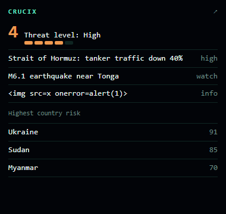

# Embedding Crucix on another site

Two ways to show Crucix inside your own page, and one to build your own widget from the [JSON API](API.md).



By default Crucix refuses to be framed (`X-Frame-Options: DENY`) and refuses cross-site reads. Both are opt-in, per
origin, so nothing changes until you set a variable in `.env`.

## 1. The ready-made widget (iframe)

A compact card: threat level (1–5), the top firing alerts and the highest country risks. It is a static page
(`/embed.html`) that reads two public routes of the same server and refreshes itself.

```env
EMBED_ORIGINS=https://example.com
```

```html
<iframe src="https://crucix.example.com/embed.html?lang=en&theme=dark"
        width="360" height="420" style="border:0" loading="lazy" title="Crucix"></iframe>
```

| Parameter | Values | Default |
|-----------|--------|---------|
| `lang` | `en`, `hu` | `en` |
| `theme` | `dark`, `light` | `dark` |
| `alerts` | 0–8 top alerts shown | 3 |
| `countries` | 0–20 country rows shown | 5 |
| `refresh` | seconds between reloads, 15–3600 | 60 |

The widget loads no fonts, scripts or images from anywhere else, and writes server data only as text. The arrow in its
corner opens the full dashboard in a new tab.

## 2. The full dashboard (iframe)

```html
<iframe src="https://crucix.example.com/" width="100%" height="800" style="border:0"></iframe>
```

Needs the same `EMBED_ORIGINS`. It is the whole Jarvis HUD, so give it room (at least 1100 × 700) and expect it to be
heavy: the globe uses WebGL and the page keeps an event stream open.

## 3. Your own widget from the API

When the card is not what you want, read the API from your page (`CORS_ORIGINS`, see [API.md](API.md#cross-origin-reads-cors)):

```env
CORS_ORIGINS=https://example.com
```

```html
<span id="crucix-level">…</span>
<script>
  fetch('https://crucix.example.com/api/alerts/summary')
    .then(r => r.json())
    .then(s => { document.getElementById('crucix-level').textContent = 'Threat level ' + s.threat.level + '/5'; });
</script>
```

Write server text with `textContent`, never `innerHTML`: titles come from public feeds you do not control.

## What exactly gets allowed

| Variable | Allows | Does not allow |
|----------|--------|----------------|
| `EMBED_ORIGINS` (comma list, e.g. `https://a.com,https://b.org`) | Those origins (and the server itself) may frame `/` and `/embed.html` (`Content-Security-Policy: frame-ancestors`) | Framing any other page; any origin not listed; `*` (not accepted) |
| `CORS_ORIGINS` (comma list, or `*`) | Those origins may `GET` the `/api` routes from a browser | Changing alerts (`POST`/`PUT`/`DELETE`), `/events`, `/healthz`, cookies or credentials mode |

Entries are origins only: scheme, host and optional port, no path (`https://example.com`, not `https://example.com/page`).
A bad entry is dropped with a warning at start.

## With a password (`AUTH_USER` / `AUTH_PASSWORD`)

An iframe of a password-protected instance makes the visitor's browser ask for the Basic credentials (many browsers
block that prompt inside a frame of another site). Two ways out:

- Put both sites behind the same login or reverse proxy and let the proxy add the `Authorization` header.
- Skip the iframe and call the API from your server (`curl -u …`), then publish the numbers yourself.

Never put the password into a page's HTML or JavaScript: everyone who opens the page can read it.

## Notes

- Over HTTPS the page that frames Crucix must also be HTTPS, otherwise the browser blocks the mixed content.
- `PUBLIC_URL` changes the links in bot messages, not the embedding rules.
- The widget shows only what the server already shows on its own dashboard; it adds no new data.
